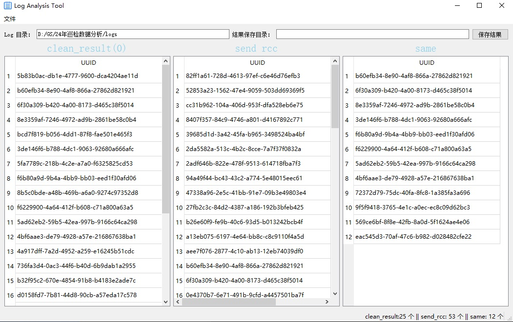

# 巡检清洁 console 日志分析工具
<div align='center'>
    
</div>

# Used
```
> pip install twine
> python setup.py bdist_wheel
> twine upload dist/log_analysis_tool-your_version-py3-none-any.whl # 会提示输入你的 PyPi Token
> pip install -U log-analysis-tool
> log_analysis_tool # 这样就会界面就会弹出来了

or

> cd log_analysis_tool
> python app.py
```